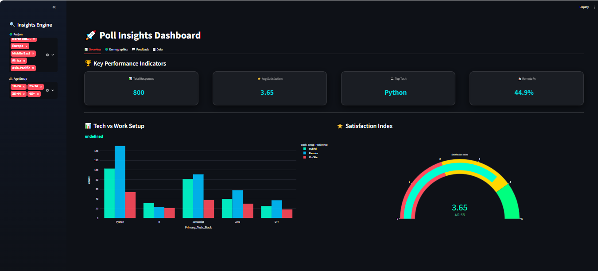
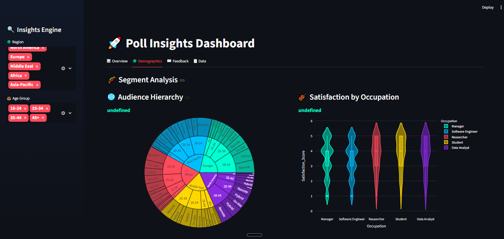
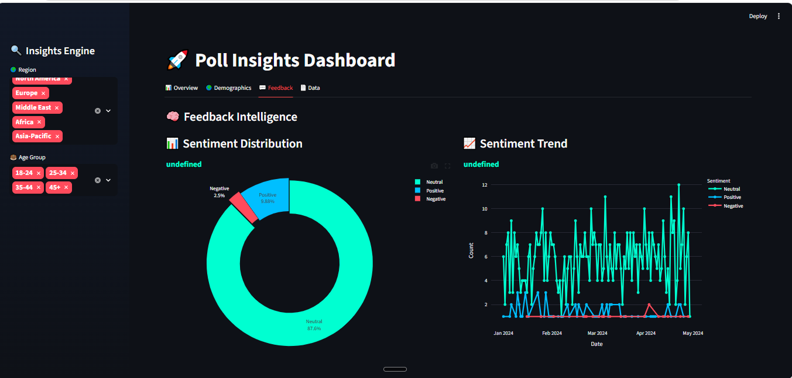

# 🚀 Poll Results Visualization Dashboard


---

## 📌 Overview

A **modern, interactive analytics dashboard** built using **Python, Streamlit, and Plotly** to analyze survey data and generate actionable insights.

This project simulates a **real-world survey intelligence system** used by organizations to track trends, satisfaction, and user behavior.

---

## ✨ Key Highlights

* 📊 Interactive dashboard with real-time filters
* 🎯 KPI cards with modern UI
* 🧠 Insight-driven analysis
* 🌐 Multi-tab navigation (no scrolling UI)
* 📈 Advanced charts (Bar, Pie, Line, Gauge, Sunburst, Violin)
* 💬 Feedback & sentiment analysis
* 🎨 Premium UI with dark theme & animations

---

## 🖥️ Dashboard Preview

### 📊 Overview



### 🌍 Demographics Analysis



### 💬 Feedback Intelligence



---

## 🛠️ Tech Stack

| Category        | Tools Used                  |
| --------------- | --------------------------- |
| Language        | Python                      |
| Data Processing | Pandas, NumPy               |
| Visualization   | Plotly, Matplotlib, Seaborn |
| Dashboard       | Streamlit                   |
| Styling         | Custom CSS                  |

---

## 📁 Project Structure

```id="c9jjbj"
Poll-Results-Visualization/
│
├── data/
│   ├── raw/
│   ├── processed/
│
├── src/
│   ├── data_generation.py
│   ├── data_cleaning.py
│   ├── analysis.py
│   ├── visualization.py
│
├── dashboard/
│   └── app.py
│
├── outputs/
│   ├── charts/
│   ├── reports/
│
├── images/
│
├── README.md
├── requirements.txt
└── .gitignore
```

---

## ⚙️ Setup Instructions

### 1️⃣ Clone Repository

```id="x1hq7n"
git clone https://github.com/abdr492/Poll-Results-Visualization.git
cd Poll-Results-Visualization
```

### 2️⃣ Create Virtual Environment

```id="rtbffu"
python -m venv venv
```

### 3️⃣ Activate Environment

```id="n53l4s"
venv\Scripts\Activate
```

### 4️⃣ Install Dependencies

```id="6ebp7k"
pip install -r requirements.txt
```

---

## ▶️ Run Dashboard

```id="pyh1dn"
streamlit run dashboard/app.py
```

🌐 Open in browser:
http://localhost:8501

---

## 📊 Key Insights

* 🐍 Python is the most preferred technology
* 🏠 Remote work yields higher satisfaction
* 👨‍💻 Younger users are more engaged
* 📈 Overall sentiment is positive

---

## 💼 Use Cases

* Data Analyst Portfolio Project
* Business Intelligence Dashboard
* Survey Data Analytics
* Research & Insights Reporting

---

## 🎤 Interview Talking Points

* Built an **end-to-end data pipeline**
* Designed a **multi-tab interactive dashboard**
* Applied **EDA and visualization techniques**
* Implemented **data-driven insights generation**
* Focused on **UI/UX for better readability**

---

## 🚀 Future Enhancements

* Real-time data streaming
* Advanced NLP sentiment analysis
* Cloud deployment (Streamlit Cloud / AWS)
* User authentication system

---

## 🤝 Connect

If you like this project ⭐, feel free to connect and collaborate!

---

⭐ **Don’t forget to star the repo if you found it useful!**
